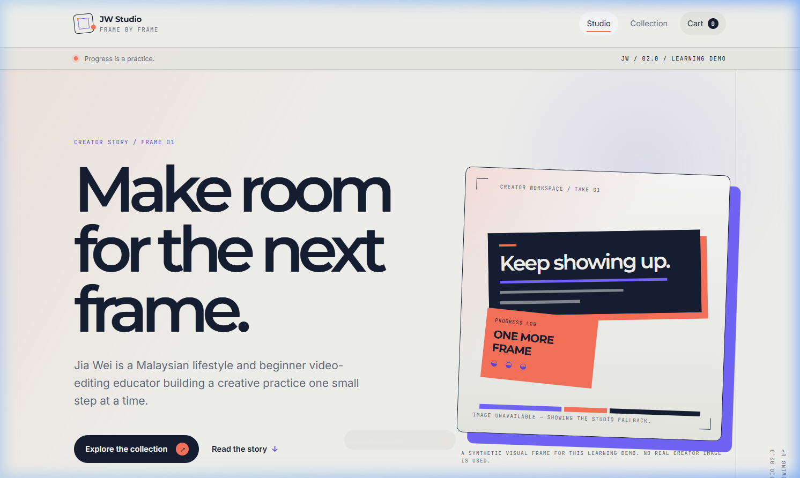
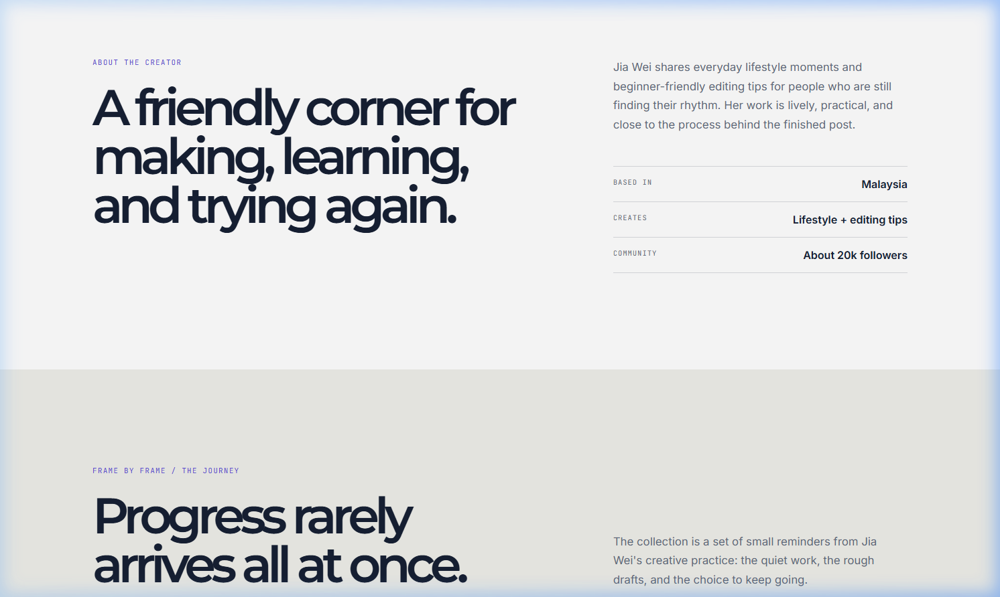
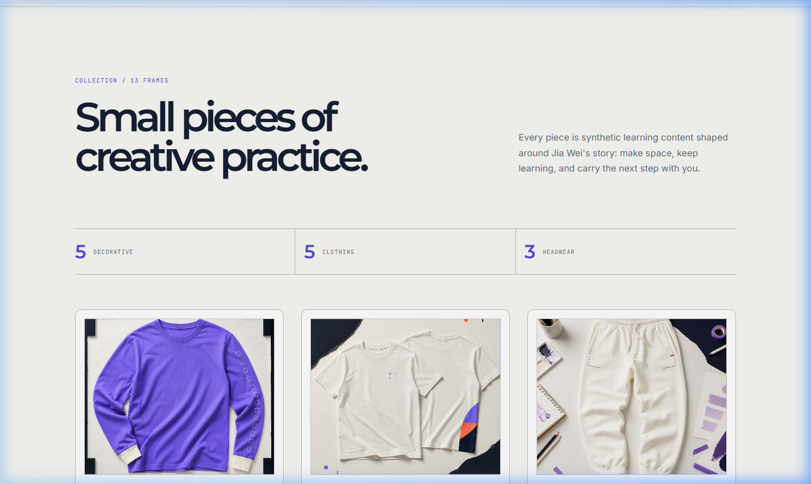
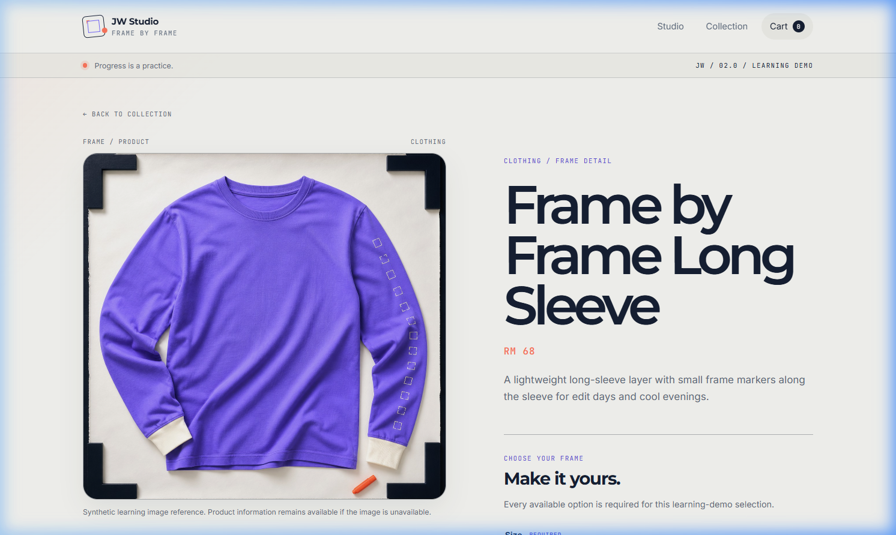
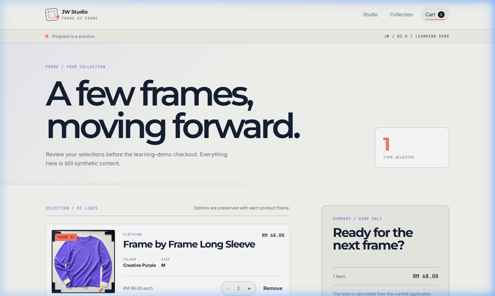
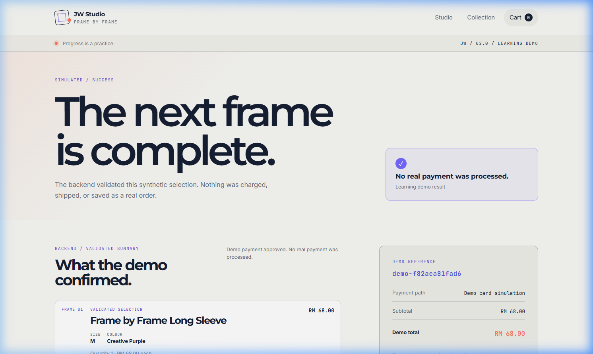

# JW Studio 2.0

A new version of the JW Studio website built as a deliberate learning project for professional, AI-assisted software development.

## Current phase

`DEPLOY-001` is complete as a deployment-readiness plan. The project has a verified browse-to-simulated-payment vertical slice, a server-side AI boundary, an optional assistant interface, a deterministic RAG safety evaluation set, and a documented keyboard/responsive/security review. No public deployment has been performed.

For a concise portfolio handoff, see `docs/portfolio-handoff.md`. For the selected Vercel + Render plan, see `docs/deployment-plan.md`.

## Visual preview

| 01. Creator Studio & Story | 02. Scrollytelling Timeline |
| :---: | :---: |
|  |  |

| 03. Product Collection (`/shop`) | 04. Product Detail & Swatch Options |
| :---: | :---: |
|  |  |

| 05. Cart Management (`/cart`) | 06. Demo Checkout & Confirmation (`/demo/result`) |
| :---: | :---: |
|  |  |


## Development workflow

1. Define the product problem and target user.
2. Write requirements and measurable acceptance criteria.
3. Propose and review the architecture.
4. Break the work into small tasks.
5. Implement one vertical slice at a time.
6. Test, review, document, and then ship.

See `AGENTS.md` for the project rules and `docs/` for the working documents.

## Verified local toolchain

- Node.js `v24.18.0`
- npm `11.16.0`
- Python `3.13.5`
- Git `2.45.1.windows.1`

## Local development

### Frontend

From `frontend/`:

```powershell
npm install
npm run dev
```

The frontend build and lint checks are:

```powershell
npm run build
npm run lint
```

The focused frontend checks are:

```powershell
npm test
```

The first end-to-end flow runs in Desktop Chrome and Pixel 5 projects. Playwright browsers are kept in a project-local folder:

```powershell
$env:PLAYWRIGHT_BROWSERS_PATH = Join-Path (Resolve-Path ..).Path '.playwright-browsers'
npx playwright install chromium
npm run test:e2e
```

### Backend

The project uses the local virtual environment in `backend/.venv/`. From `backend/`:

```powershell
.\.venv\Scripts\python.exe -m pip install -r requirements.txt
.\.venv\Scripts\python.exe -m uvicorn app.main:app --reload
```

The backend test check is:

```powershell
.\.venv\Scripts\python.exe -m pytest
```

The current backend endpoints are:

- `GET /api/health` — backend availability check.
- `GET /api/products` — all 13 products from SQLite.
- `GET /api/products/{product_id}` — one product or a safe 404 response.
- `POST /api/demo/checkout` — validates a synthetic checkout selection and returns a demo-only result without creating an order.
- `POST /api/ai/chat` — retrieves approved synthetic context and returns a grounded answer or safe fallback.

The optional provider uses the server-side variables shown in `backend/.env.example`. The provider URL, model, and API key are never read by frontend code. When the provider is not configured or unavailable, the endpoint returns a safe fallback and the storefront remains usable.

For deployment, set the public frontend variable in `frontend/.env.example` and the backend-only variables in `backend/.env.example`. The selected hosting, HTTPS, exact-origin CORS, secret handling, error behavior, and rollback plan are documented in `docs/deployment-plan.md`. No provider account has been connected and no public release has been performed.

The synthetic catalog seed can be created or refreshed from `backend/` with:

```powershell
.\.venv\Scripts\python.exe seed_catalog.py
```

The readable source is `backend/data/products.json`. The generated SQLite file is `backend/data/catalog.sqlite3` and can always be recreated from that seed source.

## Demo and safety boundary

This is a fictional learning project. Jia Wei, the biography, products, images, and payment flow are synthetic. No real payment credentials or production secrets belong in this repository.
